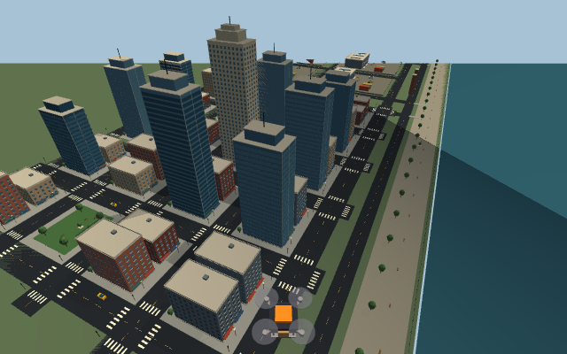
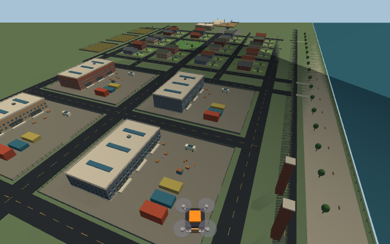
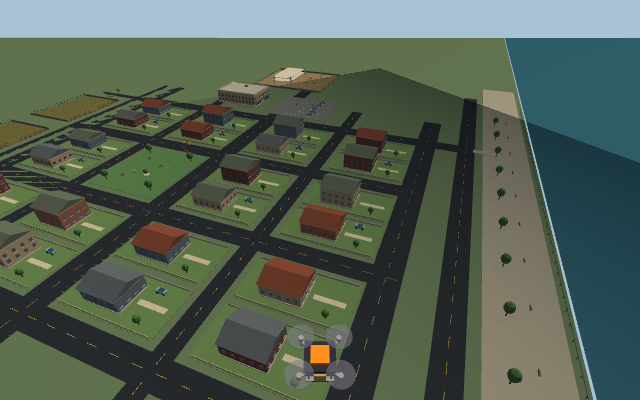
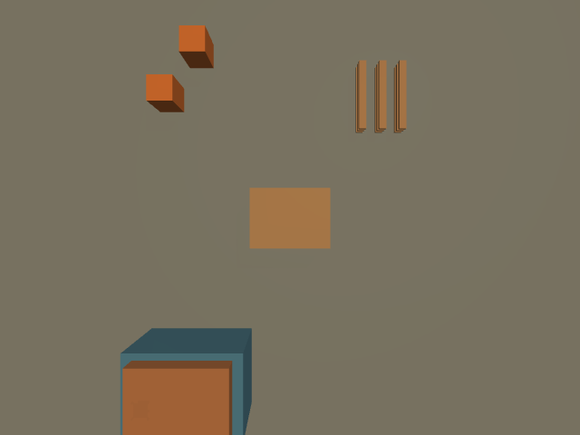
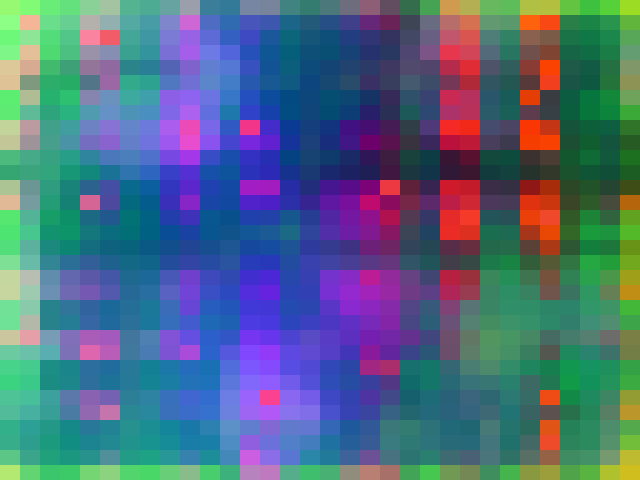
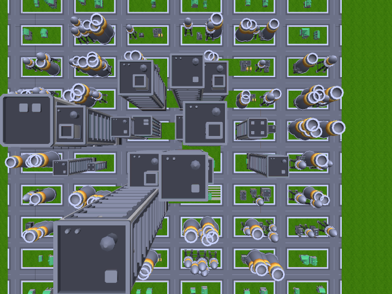
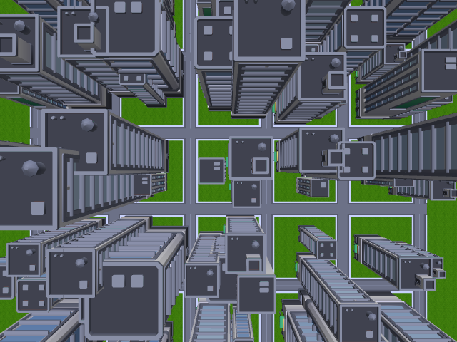
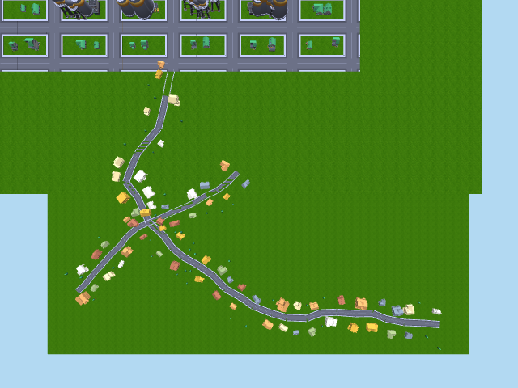
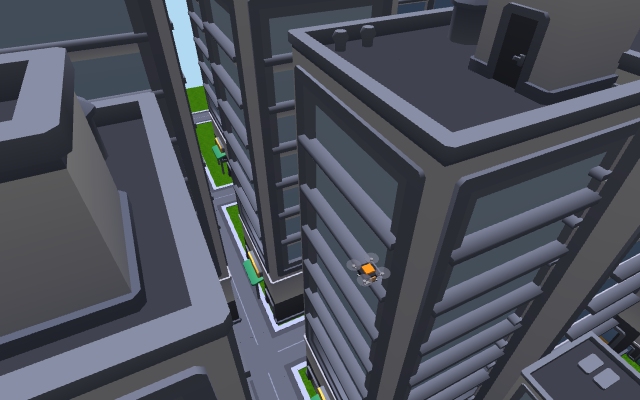
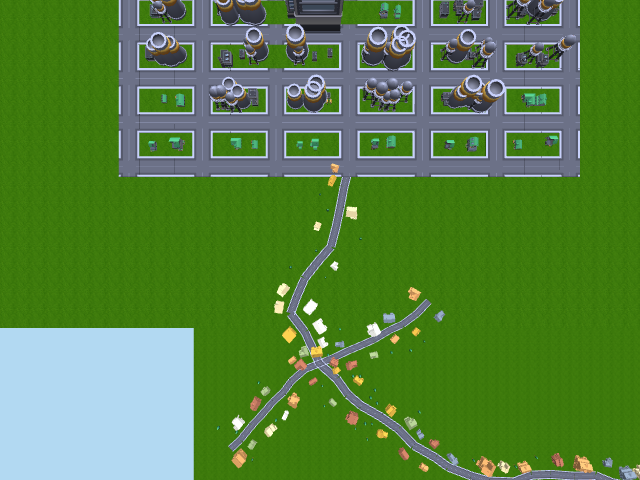

# safe_landing — 비전 기반 배송 드론 안전 착륙지 탐지

배송 드론이 목적지 근처에 도착한 뒤, **RGB+depth 카메라만으로 현재 장면을 분석해**
차·사람·장애물을 피한 안전한 빈 공간을 찾아 정밀 착륙하는 시스템 (Gazebo Classic 11 +
ROS 2 Humble).

> 좌표는 GPS가 주지만, 그 자리에 지금 뭐 있는지는 카메라만 안다.

> **다른 AI 세션이 이어서 작업하는 경우**: `docs/HANDOFF.md`부터 읽을 것 — 지금까지
> 한 작업 상세, 남은 작업, 사용자가 요청한 다음 방향(맵 꾸미기, Unity 전환 검토 등)이
> 정리돼 있다.

## 현재 시연 환경: Connected Metropolis (2026-09-14)

뉴욕풍 도심 → 공장·물류 지구 → 주거 타운을 이어 붙인 새 도시가 기본 데모 환경이다.
건물 63동, 수변 산책로·텃밭·공사장, 서로 다른 장애물이 있는 배송 목적지 12곳을 포함한다.
4곳은 지정 좌표 자체가 사람·차량·자재로 막혀 있어 비전으로 주변 공간을 찾아야 한다.

```bash
bash run_city_demo.sh 0 world   # 환경만 둘러보기
bash run_city_demo.sh 0         # 탐지기·미션·RViz 포함
```

<p align="center">
  
  
</p>
<p align="center">
  
  
</p>

[실행·목적지·검증·남은 과제](docs/CITY_ENVIRONMENT.md). 아래의 기존 비교실험 수치는 이전 평가 월드의 결과이며 새 도시 성능 수치가 아니다.

## 뭐가 새로운가

| 축 | 이 프로젝트 | 공개 오픈소스 |
|---|---|---|
| Semantic (뭔지 안다) | DINOv2 patch feature 무라벨 군집 | 있음 (OpenLander 등) |
| Geometric (평평한지 안다) | depth + 국소 표준편차 | 있음 (PX4만) |
| **둘의 융합** | ✅ | 코드 공개된 것 없음 (2026-08 조사 기준) |

`eval/`에서 이 방법을 PX4식 depth-only 재구현, OpenLander(RGB-only DNN)와 **같은 Gazebo
씬·같은 ground truth·같은 조건**으로 정량 비교했다 (아래 결과, 상세는 `eval/README.md`):

```
n=24 seed, 절차생성 월드, 목적지 상공 스캔 1프레임씩

| 방법                        | 착륙점 제시율 | 성공률(장애물 회피) | 평균 MOD(m) |
|-----------------------------|--------------|---------------------|-------------|
| 우리 방법 (DINOv2 + depth)  | 100% (24/24) | 92% (22/24)         | 3.69        |
| PX4식 depth-only            | 100% (24/24) | 71% (17/24)         | 2.22        |
| OpenLander (RGB-only DNN)   | 83% (20/24)  | 46% (11/24)         | 2.63        |
```

depth-only는 평평한 낮은 지붕을 "안전"으로 착각해 장애물 가장자리에 붙는 경향이,
OpenLander는 우리 절차생성 씬과의 도메인 격차로 확신에 찬 오판(장애물 한복판 선택)이
정량적으로 확인됐다. `eval/README.md`에 seed별 원자료와 실패 사례 상세 있음.

## 아키텍처

```
Gazebo Classic (절차생성 월드) ── 4개 카메라 + odom ──▶ landing_detector.py
                                                            │  DINOv2 패치특징 → K-means 표면군집
                                                            │  depth → 지면거리/장애물 마스크
                                                            │  "주 착륙표면"과 색 다른 표면 배제
                                                            ▼
                                                     /landing/target (안전 착륙점)
                                                            │
                                                            ▼
                                              mission_controller.py (상태머신)
                                        IDLE→TAKEOFF→CRUISE→ARRIVE→SCAN→DESCEND→LANDED
                                        (CRUISE 중엔 전방 depth로 반응형 협곡 회피,
                                         DESCEND 중 보행자 개입 시 재평가)
```

RViz(`demo.rviz`)에서 실시간으로 볼 수 있는 것: 하강캠 오버레이(안전=녹/장애물=적/선택점=황),
DINOv2 PCA 시각화, 후보 마커(점수별 색), depth 포인트클라우드, 4개 카메라 뷰. **목적지는
RViz의 "Publish Point" 툴로 클릭해서 바꿀 수 있다** — 드론이 그 자리로 재접근해서 다시 스캔한다.

<p align="center">
  
  
</p>
<p align="center"><sub>왼쪽: DINOv2 패치 특징을 PCA로 3채널에 투영한 시각화 (표면별로 색이 갈린다).
오른쪽: 하강캠에 얹은 안전 착륙점 오버레이(노란 원 = 최종 선택된 착륙점).</sub></p>

## 이전 절차생성 환경 3종 (보존된 버전)

같은 알고리즘이 서로 성격이 다른 도심 환경에서도 통하는지 보려고, 단일 회랑 데모 말고
**격자 대도시 하나**를 만들었고, 그 안에 서로 다른 밀도·도로 구조를 가진 구역 3개를 붙였다
(전부 `worlds/generate_city.py` 한 파일에서 나옴, 경로계획 그래프는 기존 격자 안에서만 동작
— 나머지 둘은 클릭 리타겟용 추가 목적지):

<p align="center">
  
  
  
</p>
<p align="center"><sub>왼쪽: 교외/산업지대/도심이 섞인 메인 격자도시(우회를 강제하는 미로형 경로,
도로 이음새 무결점). 가운데: 스카이스크래퍼 전용 맨해튼풍 구역(반듯한 격자, 산업지구 메시 없음).
오른쪽: 격자가 아예 없는 랜덤워크 길 + 낮은 집 마을(집마다 다른 색).</sub></p>

<p align="center">
  
  
</p>
<p align="center"><sub>왼쪽: 맨해튼 구역 스트리트 협곡 사이를 나는 드론. 오른쪽: 메인 격자도시와
마을을 잇는 연결로(드론 출발점 교차로에서 마을 진입점까지).</sub></p>

## 빠른 시작

### A) 네이티브 (WSL Ubuntu 22.04 + ROS 2 Humble + Gazebo Classic 11) — 시연용

```bash
cd ~/safe_landing
./go.sh                    # 백그라운드로 전체 기동, logs/launcher.log 로 출력
# 또는 포그라운드로 보고 싶으면:
./run_fixed.sh             # logs/demo_latest.log 로 고정 로그명
```

RViz로 보려면 (Windows에 VcXsrv 등 X서버 필요):
```bash
rviz2 -d demo.rviz
```

### B) Docker — 재현성 확인용 (GUI 없이 헤드리스 미션 1회)

```bash
docker build -t safe_landing .
docker run --rm safe_landing
```
컨테이너 안에서 `docker-entrypoint.sh`가 gzserver + landing_detector + mission_controller를
띄우고 "착륙 완료"가 로그에 찍히는지까지 확인한다 (최대 5분 대기). 결과/프레임을 호스트로
빼려면:
```bash
docker run --rm -v "$PWD/docker_out:/root/safe_landing/frames" safe_landing
```

> ⚠️ 이 Dockerfile은 (이 개발 세션에 docker CLI가 없어서) 아직 실제 build/run 테스트를
> 못 했다. 처음 받으면 `docker build` 로그를 한 번 끝까지 확인할 것.

### GPU 사용 (선택)

기본은 CPU torch로 빌드된다(이식성 우선). CUDA GPU로 DINOv2를 돌리고 싶으면:
```dockerfile
# Dockerfile의 torch 설치 줄을 이걸로 교체하고 nvidia-container-toolkit + --gpus all 로 실행
RUN pip3 install --no-cache-dir torch torchvision
```

## 절차생성 월드

```bash
# 단일 회랑 데모 (원래 버전, run_demo.sh가 씀)
cd worlds
python3 generate_world.py --seed 3                      # 월드 1개
python3 generate_world.py --batch 10 --outdir generated # seed 0~9 + manifest.json

# 격자 대도시 + 3구역(위 스크린샷) — run_city_demo.sh가 씀
python3 generate_city.py --seed 0 --mesh --out /tmp/city.world
bash ~/safe_landing/run_city_demo.sh 0        # 생성부터 미션까지 한 번에
```
단일 회랑은 SDF 기본 지오메트리(박스/실린더/구)로 된 회피 테스트용 시케인 회랑이고,
격자도시는 Kenney City Kit(CC0) 메시로 만든 실제 도시 스케일 환경이다. 둘 다 `--seed`로
재현 가능하게 절차생성되고, Dijkstra 최단경로로 실제로 꺾이는 구간을 강제한다. 설계 이유는
각 파일 상단 docstring 참고.

## 베이스라인 비교 재현 (남은작업 #3, #4)

```bash
source ~/venv_ros/bin/activate && source /opt/ros/humble/setup.bash
cd eval
bash models/download_openlander.sh     # 최초 1회, 11MB
python3 run_comparison.py --seeds 24
```
`eval/README.md`에 방법론(GT를 손라벨 대신 실제 배치 좌표 투영으로 계산하는 이유,
"성공"의 정의, 공정성 조건)과 전체 결과 해설이 있다.

## 파일 구성

| 경로 | 역할 |
|---|---|
| `landing_detector.py` | DINOv2 + depth → 안전점 판정 (핵심 알고리즘) |
| `mission_controller.py` | 비행 상태머신, 클릭 목적지 지정, 반응형 협곡 회피 |
| `dino_seg.py` | DINOv2 특징추출 + PCA + K-means (단독 실행 가능) |
| `frame_saver.py` | 데모 영상용 프레임 저장 |
| `worlds/generate_world.py` | 절차생성 월드 생성기 (단일 회랑) |
| `worlds/generate_city.py` | 절차생성 격자 대도시 + 맨해튼/마을 구역 + Dijkstra 경로계획 |
| `run_city_demo.sh` | 격자도시 생성→Gazebo→탐지→미션컨트롤러→RViz 한 번에 |
| `eval/` | baseline 비교 (PX4식 depth-only, OpenLander RGB-DNN) |
| `demo.rviz` | RViz 레이아웃 (하강캠 오버레이/PCA/포인트클라우드/멀티캠) |
| `Dockerfile`, `docker-entrypoint.sh` | 재현용 컨테이너 |
| `docs/fortress_spike_findings.md` | Gazebo Sim(Fortress) 전환 타당성 검토 결과 (이 환경에선 렌더러 문제로 불가) |
| `CONTEXT.md` | 설계 결정 이력, 조사 결과, 남은 작업 — 이 프로젝트의 "왜"를 알고 싶으면 여기 |

## 라이선스 / 제3자 구성요소

이 저장소의 코드는 별도 표기 없는 한 프로젝트 저작자에게 있다. `eval/`의 baseline은:
- OpenLander (MIT, Stephan Sturges) — `eval/baseline_openlander.py`, 가중치 출처는
  `eval/models/README.md` 참고.
- PX4 `safe_landing_planner` — 원본(BSD-3, archived)을 실행한 게 아니라 공개 문서를
  보고 재구현(`eval/baseline_depth_only.py`).

## 더 알고 싶으면

`CONTEXT.md` — 주제 변천사(v0 SLAM → v1 UAM 헬리패드 → v2 이 프로젝트), 설계 결정 근거,
관련연구 비교, 남은 작업 우선순위가 전부 기록돼 있다.
