# safe_landing
## RGB-D 기반 배송 드론 안전 착륙지 판단 · 종합설계 프로젝트

**배송 목적지 좌표에 장애물이 있다면, 드론은 어디에 내려야 할까?**

이 프로젝트는 배송 드론이 RGB 카메라와 깊이(depth) 영상으로 주변 장애물과 빈 공간을 판단하고,
목적지 근처에서 안전한 착륙 후보를 고르는 시스템을 만든다. DINOv2의 시각 특징과 깊이 정보를 결합하며,
ROS 2 Humble + Gazebo Classic 11에서 인식·미션 제어·시각화를 연결한다.

> **2026-09-25 마일스톤:** 환경 제작, Depth 기반 지역 경로 생성, 물류창고→맥도날드 종단 간
> 자율 배송 1회 검증, 관람객용 실시간 웹 대시보드 초안을 완료했다. 현재 DINOv2는 착륙 판단에
> 사용하며, 순항 구간의 의미 특징 결합은 비교 실험 전이다.

[개발 인수인계](docs/HANDOFF.md) · [경로 생성 구현](docs/PATH_PLANNING_IMPLEMENTATION_20260923.md) · [진행 상태](docs/PROJECT_STATUS.md) · [환경 상세](docs/CITY_ENVIRONMENT.md) · [참여형 시연 구상](docs/DEMO_SCENARIOS.md) · [1차 발표 자료](docs/presentation/README.md)

## 가장 먼저 실행하기

현재 실행 중인 서버가 없는 상태에서 아래 순서대로 시작한다. 두 터미널의 `ROS_DOMAIN_ID`는
반드시 같아야 한다. 첫 실행은 Gazebo와 DINOv2 로딩 때문에 약 20~40초 걸릴 수 있다.

### 대시보드로 목적지를 선택하는 시연

터미널 1:

```bash
cd /home/hyuneun/safe_landing
GAZEBO_MASTER_URI=http://127.0.0.1:11345 \
ROS_DOMAIN_ID=145 \
WAIT_FOR_DESTINATION=1 \
bash run_city_demo.sh 0 norviz
```

Gazebo가 열린 뒤 터미널 2:

```bash
cd /home/hyuneun/safe_landing
ROS_DOMAIN_ID=145 bash dashboard/run_dashboard.sh --host 127.0.0.1 --port 8080
```

브라우저에서 <http://127.0.0.1:8080>을 열고 **맥도날드 · 매장 앞 픽업** 카드를 누른다.
이 카드만 현재 종단 간 검증을 마쳤다. `EXPERIMENTAL` 카드는 의도적으로 비활성화되어 있다.

정상 연결 기준:

- Gazebo에 물류창고의 드론이 보인다.
- 터미널 1에 `대시보드 목적지 선택 대기 중`이 출력된다.
- 대시보드 오른쪽 위가 `ROS 실시간 연결`로 바뀐다.
- 목적지를 누르면 `TAKEOFF → CRUISE → ARRIVE → SCAN → DESCEND → LANDED` 순서로 진행한다.

### 모두 종료하기

각 실행 터미널에서 `Ctrl+C`를 누른다. 창을 닫아 프로세스가 남았는지 확인하려면:

```bash
ps -ef | rg 'gzserver|gazebo|mission_controller|landing_detector|dashboard_server'
ss -ltnp | rg ':8080|:11345'
```

출력이 없으면 모두 종료된 상태다. 포트가 이미 사용 중이라는 메시지가 나오면 기존 실행 창을
먼저 종료한다. 서로 다른 터미널에서 다른 `ROS_DOMAIN_ID`를 사용하면 화면은 열려도 ROS 데이터가
표시되지 않는다.

## 프로젝트 목표와 현재 범위

목표 시연은 **배송지 선택 → 이동 중 장애물 판단 → 주변 스캔 → 빈 공간 선택 → 착륙 또는 안전 대기**다.
관람객이 사람 이동 같은 상황 변화를 주었을 때 드론의 판단이 바뀌는 것을 보여주려 한다.

현재 구현된 것은 RGB-D 착륙점 판단, 기본 미션 상태머신, 전방 Depth 기반 다중 스텝 지역 경로 생성,
목적지 선택과 실시간 카메라·판단 상태를 표시하는 웹 대시보드다.
위치 입력은 Gazebo odom이며, 드론은 `set_entity_state`로 위치를 직접 지정하는 운동학적 모델이다.
따라서 **위치 추정까지 포함한 완전한 비전 전용 항법이나 실기체 비행 제어를 완성한 상태는 아니다.**

| 영역 | 현재 결과 | 남은 검증·구현 |
|---|---|---|
| 도시 환경 | 148동·22개 목적지, 사진 기반 서경대, 물류 출발장, 강·고가도로·산동네 | 환경 제작 마일스톤 완료; 회귀 수정 외 추가 확장 보류 |
| 착륙 인식 | DINOv2 특징 군집 + depth → 후보·선택점·오버레이 | 후보 안전성, 센서 최신성, 고도·회전 처리 |
| 기본 미션 | 이륙·경유점 이동·스캔·하강·착륙, 맥도날드 코스 1회 `LANDED` | 여러 목적지·반복 실행 성공률 측정 |
| 전방 경로 | Depth 비용 지도 → 1·2·3스텝 후보 → 비용 평가 → 첫 목표 실행·재계획 | 반복 실험, DINO 결합 비교, 전역 실패 복구 |
| 동적 상황 | 하강 중 보행자 자동 진입 이벤트 | 자연스러운 보행과 사용자 개입 버튼 |
| 사용자 인터페이스 | 목적지 선택·지도·카메라·판단 상태를 보여주는 ROS 웹 대시보드 | 검증 목적지 확대·장애물 개입·반복 배송 |

## 판단 파이프라인

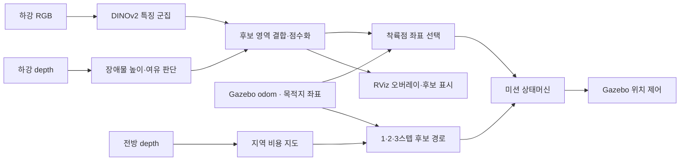

DINOv2 특징 군집은 사람·차량 이름을 출력하는 객체 검출기가 아니다. 현재 화면에는 실제 계산한
제외 영역·후보·선택점을 표시한다. 전방 회피와 하강 착륙점 판단도 서로 다른 처리 단계다.

## 전방 지역 경로 생성 예비 결과

직선 목표를 세 개의 차단 타워가 막는 같은 Gazebo 회랑에서 horizon 1·2·3을 45초씩 한 번 비교했다.
현재 단일 실행에서는 2스텝만 세 차단 구간을 지나 목표 9.0m 전까지 도달했으며 SDF 명시 충돌체 관통은 없었다.

<p align="center"></p>

| Horizon | 목표까지 남은 거리 | 계획 시간 중앙값 | 결과 |
|---:|---:|---:|---|
| 1 | 195.0m | 14.3ms | 크게 이탈 |
| 2 | 9.0m | 19.7ms | 세 차단 구간 통과 |
| 3 | 102.7m | 29.0ms | 두 번째 구간에서 안전 정지 |

각 horizon 1회인 **예비 결과**이므로 최종 성공률이나 최적값으로 주장하지 않는다. 구현 구조, ROS 출력,
재현 명령과 원자료는 [경로 생성 구현 기록](docs/PATH_PLANNING_IMPLEMENTATION_20260923.md)에 있다.

## 종단 간 자율 배송 검증

물류창고 `(-210,-88)`에서 맥도날드 배송 지점 `(172,68)`까지 실제 미션 컨트롤러로 비행했다.
124.2초 동안 이륙·순항·도착·스캔·하강을 수행했고, DINOv2 탐지 12회의 중앙값으로 착륙점을
정해 `(171.5,67.3,0.3)`에서 `LANDED`했다. 이 코스에서는 Depth가 충분한 여유를 관측해 지역
계획기가 별도 우회 조향을 선택하지 않았다. 따라서 이 영상은 종단 간 미션과 비전 착륙의 증거이며,
적극적인 장애물 우회 성능은 위 차단 회랑 실험으로 따로 평가한다.

[제3자 추적 카메라 MP4 열기](artifacts/autonomous_mcdonalds_delivery/autonomous_delivery.mp4) ·
[대시보드 화면 미리보기](dashboard/dashboard_preview.png)

두 산출물은 로컬 작업 폴더에 있다. MP4 디렉터리는 Git 제외 대상이므로 새 체크아웃에서는 녹화
명령으로 다시 생성해야 한다.

<p align="center">


</p>
<p align="center"><sub>기존 평가 장면의 기술 시각화. 현재 도시 전체의 비행 검증 결과를 뜻하지 않는다.</sub></p>

## 시뮬레이션 환경 — Connected Metropolis

뉴욕풍 도심에서 공장·물류 지구, 주거 타운, 강변 고가도로, 산동네까지 이어지는 절차생성 환경이다.
넓은 광장과 좁은 골목, 평지와 경사면, 낮은 자재와 높은 구조물을 함께 배치해 **장소가 바뀔 때마다
카메라로 착륙 가능 공간을 다시 판단해야 하는 상황**을 만든다.

<p align="center">
  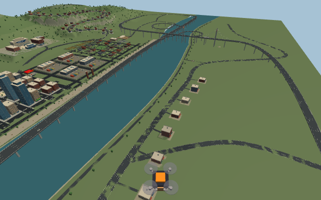
</p>
<p align="center"><sub>실제 Gazebo Classic 카메라 캡처 · seed 0 · 강 양쪽의 도시와 외곽을 연결한 확장 맵</sub></p>

| 규모·구성 | 현재 환경 |
|---|---|
| 지역 범위 | 약 2.5km × 1.9km |
| 건물 | 148동 (seed 0) |
| 배송 목적지 | 22곳 — 4곳은 지정 좌표를 사람·차량·자재가 점유 |
| 고가 교통 | 높이 24m 강변 고가도로, 34m 사장교, 270도 연결 램프와 지상 진출입로 |
| 산악 주거지 | 굽은 오르막길, 좁은 능선 골목, 옹벽과 테라스 위 주택 |
| 생성 방식 | Python → SDF 월드 + COLLADA 메시 + 목적지·도로 메타데이터 |

### 전체 맵 드론캠 영상

[60초 MP4 열기](artifacts/metropolis_tour/metropolis_flythrough.mp4) — 1280×720, 24fps.
물류창고에서 도심·상점·공장·마을·강·고가도로·서경대 캠퍼스·산동네를 빠르게 훑는다.
Gazebo RGB 카메라로 실제 월드를 촬영했으며, 연출한 카메라 경로로 만든 **환경 소개 영상**이다.
자율 항법이나 장애물 회피 성능을 검증한 비행 영상은 아니다.

```bash
bash eval/record_city_tour.sh artifacts/metropolis_tour --seconds 60 --fps 24
```

영상과 생성 월드·촬영 경로 JSON은 로컬 `artifacts/metropolis_tour/`에 저장되며 Git에서 제외한다.
새 체크아웃에서는 위 명령으로 재생성한다. `TOUR_MASTER_URI`와 `TOUR_ROS_DOMAIN_ID`로 촬영용 서버를 분리할 수 있다.

### 도심과 산업·주거 지구

<p align="center">
  
  
</p>
<p align="center"><sub>도심: 고층 외벽·상가·교차로 / 산업지구: 창고·컨테이너·팔레트·하역 공간</sub></p>
<p align="center">
  
  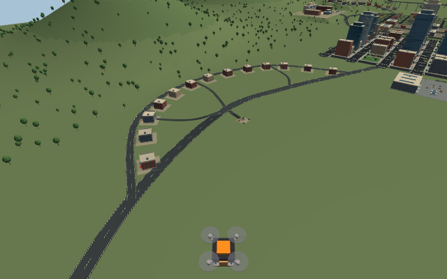
</p>
<p align="center"><sub>주거 타운의 정원·주차 공간에서 외곽의 굽은 길과 작은 골목으로 연결</sub></p>

### 배송 출발지와 생활 속 목적지

SkyDrop 물류창고의 드론 패드에서 출발해 상점과 캠퍼스로 배송하는 설정이다.
맥도날드에는 빨간 파사드·골든 아치·야외 테이블, 써브웨이에는 초록·노랑 간판과 차양을 배치했다.
서경대 캠퍼스는 제공된 실제 사진을 참고해 원통형 유리 타워·아치 강의동·회색 지붕·노란 포인트 외벽·줄무늬 광장·분수와 계단 정원으로 다시 구성했다. 실측 복원 대신 사진의 주요 형태를 반영했다.

<p align="center">
  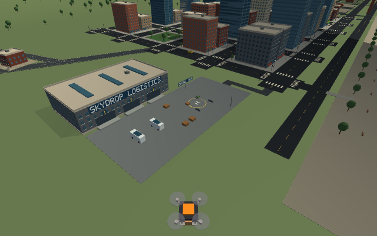
  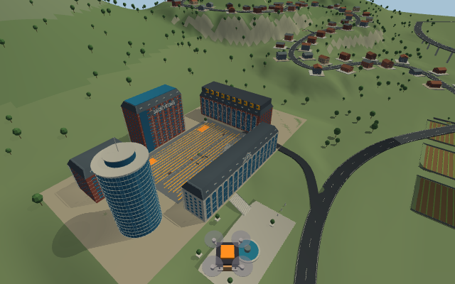
</p>
<p align="center">
  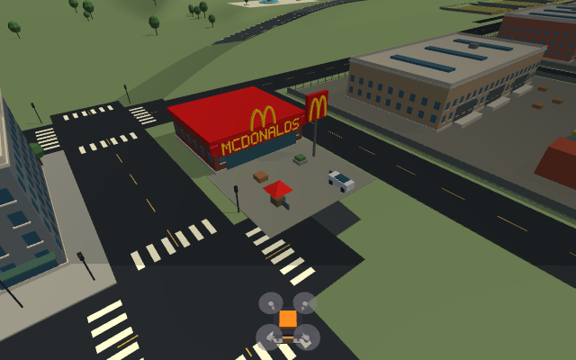
  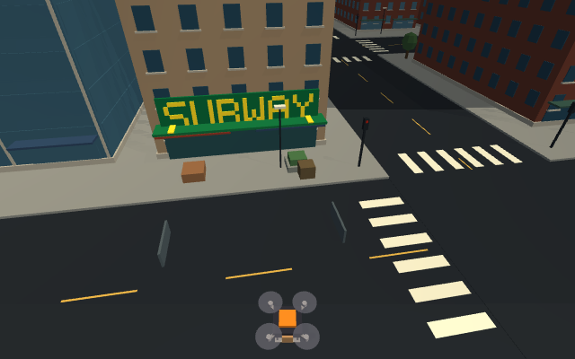
</p>

<p align="center">
  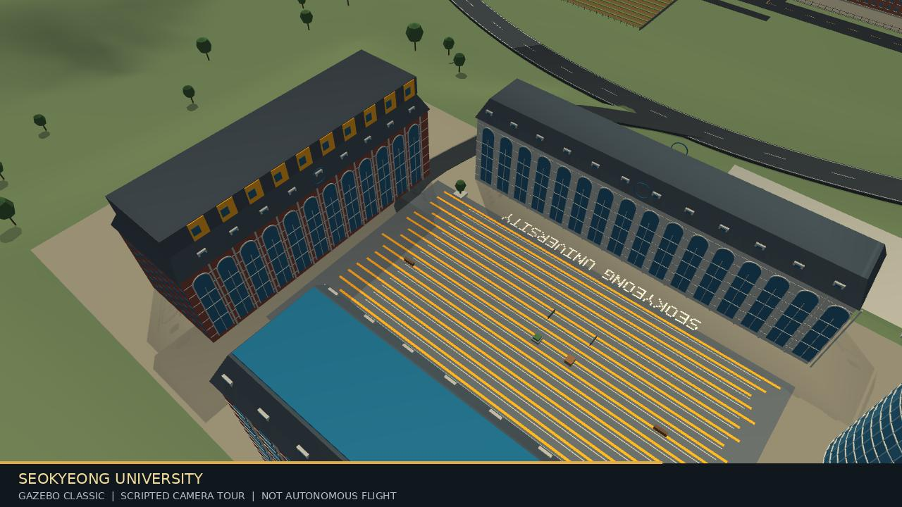
</p>
<p align="center"><sub>서경대 사진 기반 캠퍼스 — 실제 Gazebo 영상 프레임</sub></p>

### 강·고가도로와 산동네

<p align="center">
  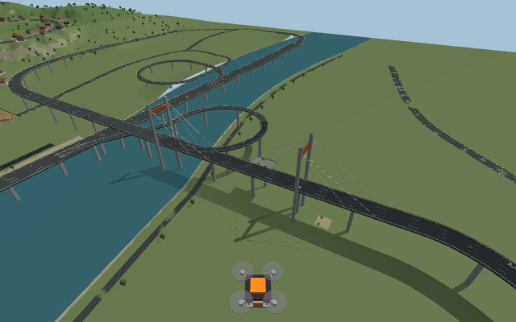
  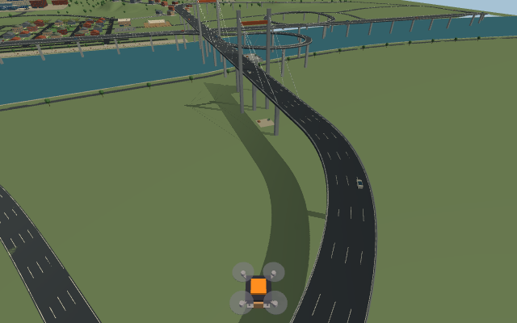
</p>
<p align="center"><sub>원형 램프와 지상 진출입로 · 교량 위와 교량 아래의 서로 다른 공간</sub></p>
<p align="center">
  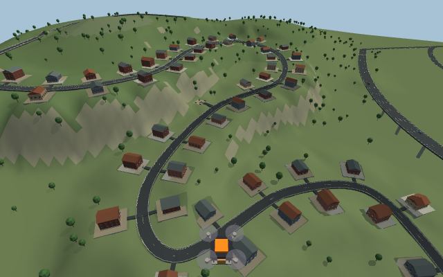
</p>
<p align="center"><sub>산길과 주택 테라스에 맞춰 지형을 절개했다. 도로·지형은 시각 메시와 같은 메시로 충돌을 처리한다.</sub></p>

### 드론이 실제로 보는 착륙 상황

<p align="center">
  
  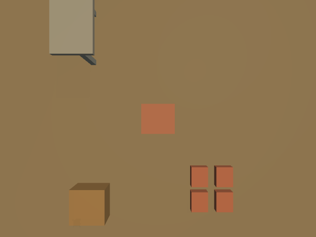
  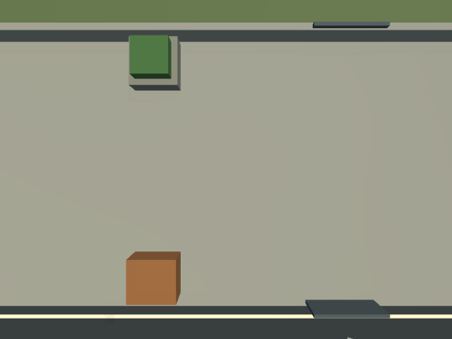
</p>
<p align="center"><sub>물류 야드 / 공사장 / 교량 점검 공간 — 목적지 표면 위 12m에서 캡처한 RGB 원본</sub></p>

22곳의 RGB·depth 수신과 장애물에 따른 깊이 변화를 확인했고, 산길 5구간은 도로가 지형에 묻히지
않는지 실제 depth로 검사했다. 시드 0·7·23에 대해 건물 겹침, 도로 경사, 대체 착륙 공간도 검사했다.
[센서 검사 결과](docs/images/metropolis/sensor_report.json)와 [목적지 좌표·검증 방법](docs/CITY_ENVIRONMENT.md)을 참고할 수 있다.

**환경 전체의 성공률은 아직 측정하지 않았다.** 물류창고→맥도날드 한 코스는 실제 순항·스캔·하강·착륙까지
1회 검증했지만, 이를 도시 전체 성능으로 확대 해석하지 않는다.
캠퍼스·교량·산동네의 고도 12/34/36/96m 목적지 4곳은 환경·센서 검증용이며, 자동 비행에는 기존 제어기의
고도 처리 수정이 필요하다. 차량은 현재 정적이며, 반복 배송과 사용자 장애물 개입은 다음 단계다.

관람객의 목적지 선택부터 이동 중 회피, 동적 장애물 개입까지의 시연 후보와 구현 순서는
[참여형 시연 구성](docs/DEMO_SCENARIOS.md)에 정리했다.

현재 코드의 구현 상태와 남은 작업, 관람객 인터랙션 흐름은 [진행 상태와 시연 계획](docs/PROJECT_STATUS.md)에 정리했다.

## 이전 착륙점 선택 실험

이전 단일 회랑 월드의 seed 0~23에서, 목적지 상공의 **정지 RGB/depth 한 프레임씩**을 사용한 비교다.
선택점 주변 드론 footprint 반경 1.0m 안에 GT 장애물이 없으면 성공으로 판정했다.
MOD는 선택점과 가장 가까운 GT 장애물 사이 거리이며, 평균은 선택점을 제시한 경우를 대상으로 한다.

| 방법 | 후보 제시 | 안전점 선택 성공 | 평균 MOD |
|---|---:|---:|---:|
| DINOv2 + depth | 24/24 | 22/24 (91.7%) | 3.69m |
| PX4 방식 depth-only 재구현 | 24/24 | 17/24 (70.8%) | 2.22m |
| OpenLander RGB-only | 20/24 | 11/24 (45.8%) | 2.63m |

2026-09-15에 로컬 `eval/results_n24/comparison.json`의 24개 행으로 수치를 다시 확인했다.
원자료는 Git 제외 대상이다. 평가 방식·기존 결과 해석은 [eval/README.md](eval/README.md)를 참고한다.
이 수치는 **새 도시 비행·하강·접촉까지 포함한 배송 성공률이 아니며**, 서로 다른 데이터셋의 논문 수치와 직접 비교하지 않는다.
기존 문서의 “최초/유일한 융합 구현” 주장은 최신 관련연구 조사 없이 확정하지 않는다.

## 참여형 시연 방향

관람객은 직접 조종하기보다 **배송지를 고르고 환경에 변화를 주는 역할**을 맡는다.
지도와 장소 카드에서 목적지를 선택하고, 전방·하강 카메라 위에서 드론의 판단 이유를 확인한다.
“사람 지나가기” 버튼은 환경만 바꾸며 알고리즘에 장애물의 정답 좌표를 전달하지 않는 방향이다.

안전 공간이 사라지면 대기·재탐색도 올바른 결과로 보여준다. 점수 경쟁이나 수동 조종은 필수가 아니다.
목적지 선택과 실시간 상태·카메라 표시는 대시보드 초안으로 구현했다. 사람/차량 개입 버튼과 반복 배송은
아직 미구현이다. 기술 측면의 다음 우선순위는 지역 계획 반복 실험과 순항 DINO 결합 비교다.

## 실행 방법 상세

### A) 네이티브 (WSL Ubuntu 22.04 + ROS 2 Humble + Gazebo Classic 11) — 시연용

ROS 2 Humble, Gazebo Classic 11과 GUI 출력 환경(현재 검증 환경: WSLg)이 필요하다.
전체 미션은 기존 `~/venv_ros`의 DINOv2·ROS Python 환경도 사용한다.

```bash
cd ~/safe_landing
bash run_city_demo.sh 0 world   # 새 맵만 둘러보기
bash run_city_demo.sh 0         # 새 맵 + 탐지기 + 기본 미션 + RViz
bash run_city_demo.sh 0 norviz  # RViz 없이 기본 미션
```

기본 지역 계획 horizon은 2다. `LOCAL_PLANNER_HORIZON=1|2|3`으로 비교할 수 있으며,
`LOCAL_PLANNER_MODE=legacy`는 이전 좌·중·우 반응형 회피 기준선을 실행한다.

`world` 모드는 탐지기와 미션을 시작하지 않는다. 기본 미션은 물류창고의 `(-210, -88)`에서 출발해 도심 대로를 거쳐
East Gate `(150, 0)`까지 이동한다. 실행 로그는 `logs/city_*.log`, 생성 결과는 `worlds/generated/`에 저장된다.
같은 Gazebo master가 이미 실행 중이면 기존 창을 종료한 뒤 실행한다.

### 관람객 대시보드와 검증된 배송 시연

목적지를 고르기 전 물류센터에서 대기시키고, 별도 터미널에서 웹 대시보드를 연다.

```bash
# 터미널 1
GAZEBO_MASTER_URI=http://127.0.0.1:11345 ROS_DOMAIN_ID=145 \
WAIT_FOR_DESTINATION=1 bash run_city_demo.sh 0 norviz

# 터미널 2
ROS_DOMAIN_ID=145 bash dashboard/run_dashboard.sh --host 127.0.0.1 --port 8080
# 브라우저: http://localhost:8080
```

대시보드는 실제 ROS 토픽에서 현재 위치·궤적·미션 상태·지역 계획 상태·추적 카메라·착륙
안전영역을 읽는다. 목적지 카드는 `/clicked_point`를 통해 미션과 착륙 탐지기에 같은 좌표를
전달한다. 2026-09-25 현재 UI에서 활성화한 종단 간 검증 코스는 **물류창고 → 맥도날드** 한 곳이다.

다음 명령은 그 코스를 제3자 추적 시점으로 다시 비행하고 MP4·계획 로그·검증 JSON을 만든다.

```bash
bash eval/record_autonomous_delivery.sh \
  artifacts/autonomous_mcdonalds_delivery mcdonalds_delivery 180 15
```

마지막 실행은 124.2초, 1280×720·15fps였으며 DINOv2 후보 12회의 중앙값으로 착륙점을
정해 `(171.5, 67.3, 0.3)`에 `LANDED`했다. 지역 계획 261회 중 정상 계획 254회,
초기 센서 대기 7회였고 명시된 SDF 충돌체 관통 표본은 0개였다. 이 결과는 한 코스 1회
검증이며 도시 전체 성공률을 뜻하지 않는다.

### B) Docker — 재현성 확인용 (GUI 없이 헤드리스 미션 1회)

```bash
docker build -t safe_landing .
docker run --rm safe_landing
```
컨테이너 안에서 `docker-entrypoint.sh`가 gzserver + landing_detector + mission_controller를
띄우고 "착륙 완료"가 로그에 찍히는지까지 확인한다 (최대 5분 대기). 결과/프레임을 호스트로
빼려면:
```bash
docker run --rm -v "$PWD/docker_out:/root/safe_landing/frames" safe_landing
```

> ⚠️ 이 Dockerfile은 (이 개발 세션에 docker CLI가 없어서) 아직 실제 build/run 테스트를
> 못 했다. 처음 받으면 `docker build` 로그를 한 번 끝까지 확인할 것.

### GPU 사용 (선택)

기본은 CPU torch로 빌드된다(이식성 우선). CUDA GPU로 DINOv2를 돌리고 싶으면:
```dockerfile
# Dockerfile의 torch 설치 줄을 이걸로 교체하고 nvidia-container-toolkit + --gpus all 로 실행
RUN pip3 install --no-cache-dir torch torchvision
```

## 월드 생성과 환경 검증

```bash
# 현재 확장 맵: 월드·메시·목적지 및 도로 메타데이터 생성
python3 worlds/generate_metropolis.py --seed 0 --out /tmp/metropolis/city.world

# 시드 0·7·23의 배치·경사·착륙 공간 검사
python3 -m unittest discover -s eval -p test_metropolis.py

# 별도 Gazebo 서버에서 전경·목적지·산길의 RGB/depth 캡처 후 서버 종료
bash eval/validate_metropolis.sh /tmp/metropolis_validation
```

생성된 `.world`는 옆의 `city_assets/`를 절대 경로로 참조한다. 다른 위치나 컴퓨터에서 사용할 때에는
해당 위치에서 다시 생성한다. 시드는 건물 높이·재질 등을 바꾸며, 도로와 목적지 위치는 유지한다.

<details>
<summary>이전 단일 회랑·격자도시 생성기</summary>

기존 평가와 개발 이력을 재현할 수 있도록 이전 생성기를 보존했다.

```bash
python3 worlds/generate_world.py --seed 3
python3 worlds/generate_world.py --batch 10 --outdir worlds/generated_legacy
python3 worlds/generate_city.py --seed 0 --mesh --out /tmp/legacy_city.world
```

`generate_world.py`는 단일 회랑, `generate_city.py`는 이전 격자도시·맨해튼·마을 구역을 만든다.
이전 `go.sh`·`run_fixed.sh`는 단일 회랑 데모 진입점이며, 현재 확장 맵은 `run_city_demo.sh`로 연다.
이전 메시 환경에는 Kenney City Kit(CC0)를 사용했다.

</details>

## 베이스라인 비교 재현

```bash
source ~/venv_ros/bin/activate && source /opt/ros/humble/setup.bash
cd eval
bash models/download_openlander.sh     # 최초 1회, 11MB
python3 run_comparison.py --seeds 24
```
`eval/README.md`에 방법론(GT를 손라벨 대신 실제 배치 좌표 투영으로 계산하는 이유,
"성공"의 정의, 공정성 조건)과 전체 결과 해설이 있다.

## 파일 안내

| 파일 | 역할 |
|---|---|
| [landing_detector.py](landing_detector.py) | RGB-D 기반 착륙점 선택, ROS 출력 |
| [dino_seg.py](dino_seg.py) | DINOv2 특징 추출·PCA·K-means |
| [local_path_planner.py](local_path_planner.py) | 전방 Depth 비용 지도·1~3스텝 후보 생성·비용 평가 |
| [mission_controller.py](mission_controller.py) | 상태머신·지역 계획 실행·안전 정지·클릭 목적지 |
| [worlds/generate_metropolis.py](worlds/generate_metropolis.py) | 도시 생성 진입점, SDF·DAE·manifest |
| [worlds/metropolis_region.py](worlds/metropolis_region.py) | 강·도로·지형·외곽 주거지 |
| [worlds/metropolis_landmarks.py](worlds/metropolis_landmarks.py) | 물류창고·상점·출발 경유점 |
| [worlds/metropolis_campus.py](worlds/metropolis_campus.py) | 사진 기반 서경대학교 캠퍼스 |
| [run_city_demo.sh](run_city_demo.sh) | 현재 도시 미리보기·미션 실행 |
| [eval/test_metropolis.py](eval/test_metropolis.py) | 배치·경사·대체 착륙 공간 검사 |
| [eval/validate_metropolis.sh](eval/validate_metropolis.sh) | 실제 Gazebo RGB/depth 검사 |
| [eval/record_city_tour.sh](eval/record_city_tour.sh) | 720p MP4 환경 투어 제작 |
| [eval/run_local_planner_gazebo.sh](eval/run_local_planner_gazebo.sh) | 차단 회랑 horizon 실행·로그·궤적 감사 |
| [eval/record_autonomous_delivery.sh](eval/record_autonomous_delivery.sh) | 실제 자율 배송·추적 카메라 MP4·로그 제작 |
| [dashboard/](dashboard/) | ROS 실시간 관람객용 웹 대시보드 |
| [eval/](eval/) | 이전 평가 월드의 비교 실험 |
| [docs/HANDOFF.md](docs/HANDOFF.md) | 데스크톱 앱에서 이어갈 최신 인수인계 |
| [docs/presentation/](docs/presentation/) | 1차 발표 PPTX·PDF·발표 대본·재생성 코드 |
| [CONTEXT.md](CONTEXT.md) | 과거 설계·조사 이력; 최신 상태는 HANDOFF 우선 |

## 알려진 통합 과제

- 후보가 없을 때 목적지 좌표로 하강하는 폴백이 남아 있다. 안전 대기 기능으로 보강할 대상이다.
- 탐지 좌표 변환은 yaw=0·지면 z=0을 가정한다. 캠퍼스·교량·산동네 4개 목적지는 자동 비행 전 수정이 필요하다.
- 연결요소 평균점이 실제 안전 마스크 밖에 놓일 수 있어, 후보 내부 여유 검사가 필요하다.
- 출발 대기 중 클릭은 기본 도심 경유점을 유지하고 목적지를 마지막에 붙인다. 비행 중 재지정은 직행이며 전역 재탐색과 착륙 후 반복 배송은 구현되지 않았다.
- `eval/our_method.py`와 실행용 탐지기 로직은 수동 복제되어 있다. 변경 시 평가 코드와의 일치 여부를 확인해야 한다.

## 구성요소와 재현 범위

현재 맵의 건물·간판·지형은 코드로 생성한다. 학교는 사용자 제공 사진을 참고한 창작 배치이며 실측 복원이 아니다.
과거 메시 환경에는 Kenney City Kit(CC0)를 사용했다. OpenLander 가중치 출처는 [eval/models/README.md](eval/models/README.md),
PX4 방식 비교는 공개 방식의 재구현으로 원본 PX4 비행 스택 실행과 구분한다.
Docker 구성은 보존했지만 이 환경에서 빌드·실행 검증을 완료한 것으로 취급하지 않는다.
