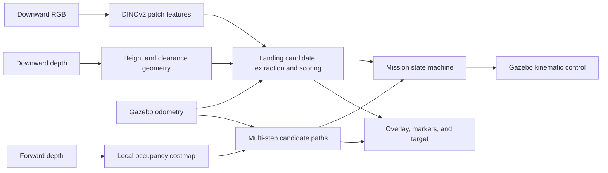
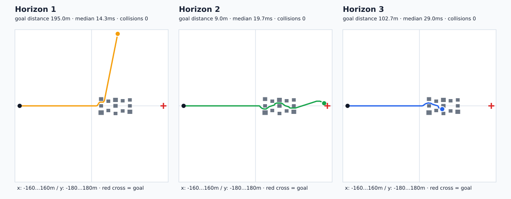
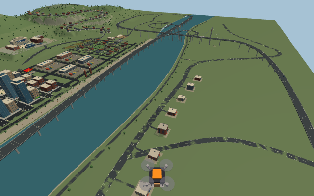
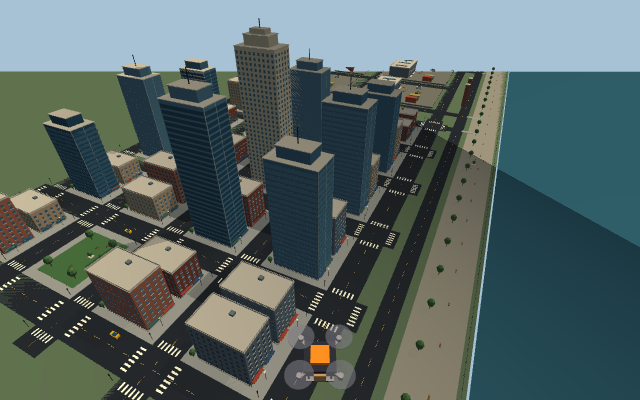
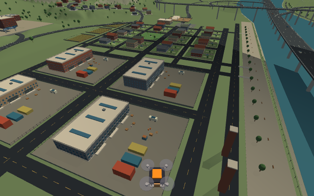
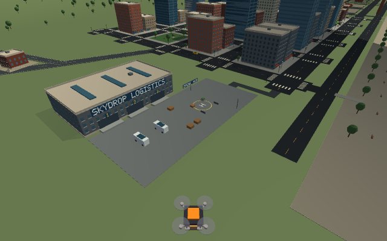
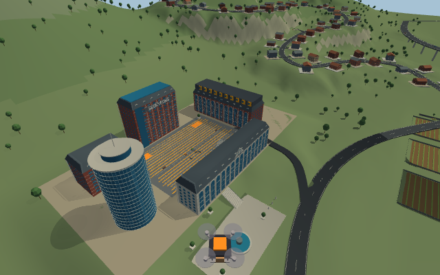
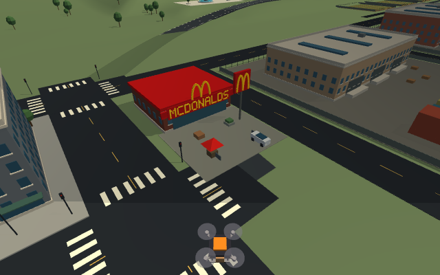
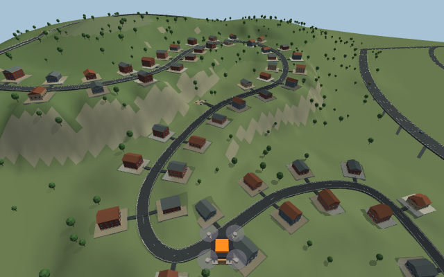

# Vision-Guided Safe Landing for an Autonomous Delivery Drone

An RGB-D perception and local path-planning system for autonomous drone delivery in ROS 2 and Gazebo Classic.

The project addresses a practical question: **if the requested delivery coordinate is occupied, where should the drone land instead?** The drone uses camera observations to navigate toward a destination, inspect the surrounding surface, reject obstacles, select a feasible landing area, and descend while continuing to re-evaluate the scene.

> **Current milestone — September 2026:** The simulation environment, depth-based local path planner, one end-to-end warehouse-to-restaurant delivery run, and the first local dashboard prototype are complete. DINOv2 is currently used for landing-area analysis. Its use during cruise remains an open experiment.

[Project handoff](docs/HANDOFF.md) · [Path-planning implementation](docs/PATH_PLANNING_IMPLEMENTATION_20260923.md) · [Project status](docs/PROJECT_STATUS.md) · [Environment documentation](docs/CITY_ENVIRONMENT.md) · [Demo scenarios](docs/DEMO_SCENARIOS.md) · [Presentation materials](docs/presentation/README.md)

## Project Scope

The intended public demonstration is:

1. A visitor selects a delivery destination.
2. The drone follows a global route while checking forward depth observations.
3. The local planner stops, redirects, or re-observes when the route is obstructed.
4. The drone scans the destination from above.
5. RGB-D perception rejects occupied or unsuitable areas.
6. The controller selects a landing point and descends.
7. If the scene changes during descent, the landing point is evaluated again.

The current system uses Gazebo odometry as its position input and moves the simulated drone through `set_entity_state`. It is therefore a **kinematic simulation of perception, planning, and mission logic**, rather than a completed flight-dynamics controller or a fully vision-only localization system.

| Area | Implemented | Remaining work |
|---|---|---|
| Environment | Procedural city with 148 buildings and 22 destinations, logistics depot, industrial district, river, elevated roads, hillside housing, and a photo-inspired Seokyeong University area | Freeze the environment except for regression fixes |
| Landing perception | DINOv2 feature clustering and depth geometry, candidate extraction, scoring, overlays, and ROS outputs | Improve stale-sensor handling, candidate validity checks, rotation, and non-zero ground elevation |
| Mission control | Takeoff, waypoint cruise, arrival, scan, descent, landing, and optional destination-selection wait state | Repeated delivery, return-to-base, and mission reset |
| Local planning | Forward-depth costmap, one-to-three-step candidate generation, hard collision rejection, scoring, and receding-horizon execution | Repeated evaluation, stronger dead-end recovery, and global replanning |
| Dynamic scene | Automatic pedestrian intrusion during descent | Visitor-triggered pedestrians and vehicles |
| Interface | Local ROS dashboard with destination selection, map, camera feeds, mission state, and planning state | More validated destinations and intervention controls |

## System Architecture


```mermaid
flowchart LR
    RGB[Downward RGB] --> DINO[DINOv2 patch features]
    DEPTH[Downward depth] --> GEOMETRY[Height and clearance geometry]
    DINO --> LANDING[Landing candidate extraction and scoring]
    GEOMETRY --> LANDING
    ODOM[Gazebo odometry] --> LANDING
    LANDING --> MISSION[Mission state machine]

    FRONT[Forward depth] --> COSTMAP[Local occupancy costmap]
    COSTMAP --> PLANNER[Multi-step candidate paths]
    ODOM --> PLANNER
    PLANNER --> MISSION

    MISSION --> GAZEBO[Gazebo kinematic control]
    LANDING --> OUTPUT[Overlay, markers, and target]
    PLANNER --> OUTPUT
```

DINOv2 does not produce semantic labels such as *person*, *car*, or *road* in this project. It provides patch-level visual features that are clustered to distinguish surface regions. Depth supplies the geometric obstacle and clearance evidence. Forward obstacle avoidance and downward landing analysis are separate stages.

## Local Path Planner

The planner combines a pre-generated global waypoint route with a depth-only receding-horizon local planner.

At each planning cycle, the controller:

1. Converts the forward depth image into a local occupancy grid.
2. Inflates occupied cells by a 1.2 m safety radius.
3. Generates steering sequences from `-40°, -20°, 0°, +20°, +40°`.
4. Predicts one to three 4 m steps; horizon 2 is the current default.
5. Rejects any candidate that intersects an inflated obstacle.
6. Scores the remaining candidates.
7. Executes only the first step and replans from the next depth frame.

The current cost function is:

```text
total cost =
    0.45 × normalized remaining goal distance
  + 0.30 × clearance deficit
  + 0.15 × steering effort
  + 0.10 × unknown-space ratio
```

If every candidate is blocked, the drone stops. It then rotates in place to acquire a new depth observation before trying again.

### Preliminary horizon comparison

Horizon 1, 2, and 3 were each run once for 45 seconds in the same Gazebo corridor containing three blocking towers.

<p align="center"></p>

| Horizon | Remaining distance | Median planning time | Observed result |
|---:|---:|---:|---|
| 1 | 195.0 m | 14.3 ms | Large route deviation |
| 2 | 9.0 m | 19.7 ms | Passed all three blocked sections |
| 3 | 102.7 m | 29.0 ms | Stopped near the second section |

These are preliminary single-run results. They do not establish an optimal horizon or a success rate. Raw logs and the evaluation procedure are documented in [PATH_PLANNING_IMPLEMENTATION_20260923.md](docs/PATH_PLANNING_IMPLEMENTATION_20260923.md).

## End-to-End Delivery Run

One full mission was recorded from the logistics depot `(-210, -88)` to the restaurant delivery point `(172, 68)`.

- Duration: 124.2 seconds
- Video: 1280×720 at 15 fps
- Final mission state: `LANDED`
- Final position: `(171.5, 67.3, 0.3)`
- Landing target: median of 12 DINOv2-assisted detections
- Local planner records: 254 valid plans and 7 initial no-sensor records
- Explicit SDF collision penetrations: 0 observed samples

[Open the local chase-camera recording](artifacts/autonomous_mcdonalds_delivery/autonomous_delivery.mp4) · [Open the dashboard preview](dashboard/dashboard_preview.png)

The route was clear at cruise altitude, so the local planner did not need to choose a steering deviation during this run. The recording demonstrates end-to-end mission execution and vision-guided landing. Active obstacle detouring is evaluated separately in the blocked-corridor experiment.

The video directory is excluded from Git. Regenerate it with:

```bash
bash eval/record_autonomous_delivery.sh \
  artifacts/autonomous_mcdonalds_delivery mcdonalds_delivery 180 15
```

## Simulation Environment

Connected Metropolis is a procedurally generated Gazebo Classic environment designed to expose the perception system to different structures and landing surfaces.

| Property | Seed 0 environment |
|---|---|
| Approximate area | 2.5 km × 1.9 km |
| Buildings | 148 |
| Delivery destinations | 22 |
| Occupied nominal destinations | 4 |
| Elevated transport | 24 m expressway, 34 m cable-stayed bridge, circular ramp |
| Terrain | Flat downtown, riverbanks, slopes, terraces, and mountain roads |
| Generated assets | SDF world, COLLADA meshes, and destination metadata |

<p align="center"></p>

The environment includes:

- A dense downtown with glass towers, brick buildings, plazas, alleys, and parked vehicles
- A logistics depot, warehouses, freight yards, containers, pallets, and construction obstacles
- Residential streets, gardens, small shops, and irregular old-town roads
- A river, elevated expressway, bridge, interchange, and under-bridge areas
- Hillside housing, switchback roads, retaining walls, and elevated terraces
- Restaurant delivery points and a Seokyeong University-inspired campus

<p align="center">
  
  
</p>
<p align="center">
  
  
</p>
<p align="center">
  
  
</p>

The campus is an original simulation layout inspired by three user-provided photographs. It is not a surveyed or geometrically exact reconstruction of the real university.

### Scripted environment tour

The separate city-tour video is a scripted Gazebo camera flight for presenting the environment. It is not autonomous-flight evidence.

```bash
bash eval/record_city_tour.sh artifacts/metropolis_tour --seconds 60 --fps 24
```

## Running the Project

### Requirements

- Ubuntu 22.04 or WSL2 with WSLg
- ROS 2 Humble
- Gazebo Classic 11
- Python 3.10
- The existing `~/venv_ros` environment for PyTorch and DINOv2
- FFmpeg for video generation

### Environment preview

```bash
cd /home/hyuneun/safe_landing
bash run_city_demo.sh 0 world
```

This starts only the generated world. It does not start perception or autonomous flight.

### Default autonomous mission

```bash
cd /home/hyuneun/safe_landing
bash run_city_demo.sh 0
```

Use `norviz` as the second argument to omit RViz.

### Destination-selection dashboard

The dashboard is a **local development prototype**. It has not been deployed or published as a hosted service.

Start the simulation in the first terminal:

```bash
cd /home/hyuneun/safe_landing
env -u GAZEBO_MASTER_URI \
ROS_DOMAIN_ID=145 \
WAIT_FOR_DESTINATION=1 \
bash run_city_demo.sh 0 norviz
```

After Gazebo and DINOv2 finish loading, start the dashboard bridge in a second terminal:

```bash
cd /home/hyuneun/safe_landing
ROS_DOMAIN_ID=145 bash dashboard/run_dashboard.sh --port 8080
```

Open the page reported by the dashboard process. The two terminals must use the same `ROS_DOMAIN_ID`. The currently validated destination card is **McDonald's Delivery**; experimental cards remain disabled.

A healthy session shows:

- The drone waiting at the logistics depot
- A destination-selection wait message in the mission log
- A live ROS connection indicator in the dashboard
- Mission transitions through `TAKEOFF`, `CRUISE`, `ARRIVE`, `SCAN`, `DESCEND`, and `LANDED`

Stop both foreground processes with `Ctrl+C`. Verify that no related processes remain with:

```bash
ps -ef | rg 'gzserver|gazebo|mission_controller|landing_detector|dashboard_server'
```

### Planner configuration

```bash
LOCAL_PLANNER_HORIZON=1 bash run_city_demo.sh 0 norviz
LOCAL_PLANNER_HORIZON=2 bash run_city_demo.sh 0 norviz
LOCAL_PLANNER_HORIZON=3 bash run_city_demo.sh 0 norviz
LOCAL_PLANNER_MODE=legacy bash run_city_demo.sh 0 norviz
```

`legacy` preserves the previous left-center-right reactive baseline.

## Validation and Reproduction

```bash
# Python and planner tests
python3 -m unittest discover -s eval -p 'test_*.py'

# Generate a fresh metropolis world
python3 worlds/generate_metropolis.py --seed 0 --out /tmp/metropolis/city.world

# Capture and inspect RGB-D views from the generated world
bash eval/validate_metropolis.sh /tmp/metropolis_validation

# Run one blocked-corridor horizon experiment
bash eval/run_local_planner_gazebo.sh /tmp/planner_h2 2 45
```

The environment checks cover model naming, mesh references, building overlap, road slopes, alternate landing space, and the agreement between the drone spawn point and the generated manifest. RGB and depth were also captured for all 22 destinations.

The earlier static landing-point benchmark used one RGB-D frame from each of 24 generated scenes:

| Method | Produced a candidate | Safe selections | Mean obstacle distance |
|---|---:|---:|---:|
| DINOv2 + depth | 24/24 | 22/24 (91.7%) | 3.69 m |
| Reconstructed PX4-style depth baseline | 24/24 | 17/24 (70.8%) | 2.22 m |
| OpenLander RGB-only | 20/24 | 11/24 (45.8%) | 2.63 m |

This benchmark measures landing-point selection on static frames. It is not a city-wide delivery success rate, and the reconstructed baseline is not the original PX4 flight stack.

## Repository Guide

| Path | Purpose |
|---|---|
| [landing_detector.py](landing_detector.py) | RGB-D landing analysis and ROS outputs |
| [dino_seg.py](dino_seg.py) | DINOv2 feature extraction, PCA, and clustering |
| [local_path_planner.py](local_path_planner.py) | Local costmap, candidate paths, and path costs |
| [mission_controller.py](mission_controller.py) | Mission state machine and local-plan execution |
| [run_city_demo.sh](run_city_demo.sh) | Main city preview and mission launcher |
| [dashboard/](dashboard/) | Local ROS dashboard and HTTP bridge |
| [worlds/generate_metropolis.py](worlds/generate_metropolis.py) | Current environment generator entry point |
| [worlds/metropolis_region.py](worlds/metropolis_region.py) | Terrain, river, roads, bridges, and hillside region |
| [worlds/metropolis_landmarks.py](worlds/metropolis_landmarks.py) | Logistics depot, shops, signs, and route landmarks |
| [worlds/metropolis_campus.py](worlds/metropolis_campus.py) | Photo-inspired campus geometry |
| [eval/record_autonomous_delivery.sh](eval/record_autonomous_delivery.sh) | End-to-end flight recording and log collection |
| [eval/run_local_planner_gazebo.sh](eval/run_local_planner_gazebo.sh) | Blocked-corridor planner experiment |
| [eval/validate_metropolis.sh](eval/validate_metropolis.sh) | Gazebo RGB-D environment validation |
| [docs/HANDOFF.md](docs/HANDOFF.md) | Current technical handoff |
| [docs/presentation/](docs/presentation/) | Presentation deck, notes, and generation scripts |

## Known Limitations

- The controller still falls back to the nominal destination if no landing candidate is collected during the initial scan. This should become a hold, re-scan, or abort behavior.
- Landing-coordinate conversion assumes zero yaw and ground elevation `z=0`.
- Elevated campus, bridge, and hillside destinations require surface-height-aware control before autonomous use.
- Runtime destination changes during cruise use a direct global segment; there is no online global route search yet.
- The local planner can stop and re-observe, but it does not guarantee recovery from every dead end.
- The drone uses kinematic pose updates, so flight dynamics and actuator control are outside the current validation scope.
- The landing evaluator and runtime detector contain separately maintained logic that must remain synchronized.
- Only one destination currently has a recorded end-to-end validation run.
- The dashboard has not been deployed and should not be presented as a public service.

## Next Technical Milestones

1. Repeat horizon experiments across multiple obstacle layouts and initial conditions.
2. Compare the multi-step planner with the legacy reactive baseline using the same metrics.
3. Record failure classes: route deviation, persistent `NO_PATH`, stale sensor data, timeout, and collision.
4. Replace the unsafe no-candidate landing fallback with hold, re-observation, and abort states.
5. Add online global route generation for arbitrary destinations.
6. Validate additional destinations before enabling their dashboard cards.
7. Compare depth-only cruise planning with a DINOv2-assisted alternative.
8. Add visitor-triggered dynamic obstacles and repeated-delivery mission reset.

## Asset and Reproducibility Notes

The current city geometry, signs, terrain, and campus scene are generated by project code. Older experiments used the Kenney City Kit under CC0. OpenLander model provenance is documented in [eval/models/README.md](eval/models/README.md).

Generated worlds, frames, logs, evaluation outputs, and videos are excluded from Git where appropriate. Regenerate the world after moving the repository because generated SDF files may contain absolute mesh paths.
