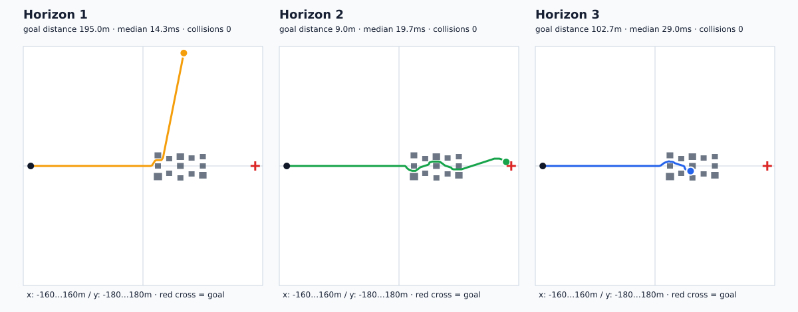

# 비전 기반 지역 경로 생성 1차 구현 — 2026-09-23

지도교수 피드백 이후 구현한 첫 동작 버전과 예비 실험을 기록한다. 설계 배경은 [교수 피드백 분석](PROFESSOR_FEEDBACK_AND_PATH_PLANNING.md), 구현 전 상태는 [체크포인트](CHECKPOINT_20260923.md)를 참고한다.

## 구현 결과

`local_path_planner.py`를 추가했다. 전방 Depth 영상 한 장을 드론 로컬 좌표의 점유 격자로 바꾸고, horizon 1~3의 짧은 후보 경로를 생성한다.

1. 전방 Depth 중앙 높이 영역을 사용한다.
2. 각 영상 열의 가까운 5 percentile 거리를 광선의 대표 거리로 계산한다.
3. 광선 진행 구간은 free, 반환점은 obstacle, 보지 못한 영역은 unknown으로 기록한다.
4. 장애물을 기체 안전 반경 1.2m만큼 팽창한다.
5. 매 스텝 `-40°, -20°, 0°, +20°, +40°` 후보를 생성한다.
6. 충돌 후보를 제거하고 목적지 거리, 장애물 여유, 회전량, 미관측 영역 비용을 계산한다.
7. 최적 후보의 첫 좌표만 실행하고 0.25초 뒤 새 Depth로 다시 계획한다.
8. 후보가 없으면 정지한다. 같은 시야에서 계속 막히면 마지막 우회 방향으로 제자리 회전해 새 Depth를 받은 뒤 다시 계획한다.

현재 가중치는 초기값이며 반복 실험 전 최적값으로 주장하지 않는다.

| 비용 | 초기 가중치 |
|---|---:|
| 목적지 접근 | 0.45 |
| 장애물 여유 | 0.30 |
| 회전량 | 0.15 |
| 미관측 영역 | 0.10 |

## 기존 구현과의 차이

기존 `compute_avoid_offset()`은 Depth를 좌·중·우로 나누고 넓은 방향으로 최대 9m 오프셋을 주는 규칙이다. 새 방식은 복수의 좌표열을 실제로 생성하고 후보마다 비용을 계산한다. 기존 방식은 `LOCAL_PLANNER_MODE=legacy`로 보존해 비교군으로 사용할 수 있다.

manifest waypoint는 여전히 전역 경유점이다. 새 계획기는 현재 경유점까지의 **지역 경로**를 RGB-D 관측 범위 안에서 만든다. 전역 waypoint와 지역 경로의 역할을 구분한다.

## ROS 출력과 시각화

| 출력 | 내용 |
|---|---|
| `/planning/local_costmap` | free / obstacle / unknown 지역 격자 |
| `/planning/candidates` | 유효 후보, 충돌 탈락 후보, 선택 경로, 첫 목표점 |
| `/planning/selected_path` | 선택된 1~3스텝 경로 |
| `/planning/local_target` | 이번 주기에 실제 실행할 첫 좌표 |
| `/planning/status` | 후보 수, 비용 성분, 최소 여유, 계산 시간 |

RViz 설정에도 비용 지도와 후보·선택 경로 표시를 추가했다. 매 계획 결과는 JSONL로 저장되어 사후 비교가 가능하다.

## 안전 동작

- Depth가 없거나 0.8초 이상 오래되면 이동하지 않는다.
- 모든 후보가 장애물 안전 반경과 겹치면 `NO_PATH`로 정지한다.
- 경로가 없을 때 위치는 유지하고 yaw만 바꿔 새로운 방향을 관측한다.
- 최대 재관측 횟수를 넘으면 계속 정지한다.
- 경유지가 바뀌면 새 구간을 바라본 뒤 이전 방향의 Depth를 폐기한다.

## Gazebo 예비 실험

기존 `residential_delivery.world`의 직선 경로 중앙에는 세 개의 차단 타워와 측면 건물이 있다. 사전 우회 waypoint 없이 `(-150,0) → (150,0)`을 목표로 두고 horizon별로 45초씩 한 번 실행했다.



| Horizon | 목표까지 남은 거리 | 목표 10m 이내 | 궤적 길이 | 계획시간 중앙값 | 재관측 | SDF 관통 표본 |
|---:|---:|:---:|---:|---:|---:|---:|
| 1 | 195.0m | 아니오 | 337.1m | 14.3ms | 1 | 0 |
| 2 | 9.0m | 예 | 309.3m | 19.7ms | 11 | 0 |
| 3 | 102.7m | 아니오 | 204.8m | 29.0ms | 10 | 0 |

이 단일 실행에서는 horizon 2만 세 차단 구간을 모두 지나 목표 10m 이내에 도달했다. horizon 1은 첫 장애물을 피한 뒤 목표 방향을 회복하지 못해 크게 이탈했고, horizon 3은 두 번째 차단 구간에서 경로 없음으로 안전 정지했다. horizon 2의 궤적과 SDF 명시 충돌체 사이 최소 표면 여유는 0.838m였고, 기체 반경 0.36m 기준 관통 표본은 0개였다.

이 결과는 **n=1 예비 실험**이다. horizon 2가 일반적으로 가장 좋다는 결론이나 성공률로 사용하지 않는다. 반복 횟수, 장애물 배치, 초기 위치를 늘려 평균과 분산을 계산해야 한다. `model://`로 포함된 외부 모델 내부 충돌체는 현재 SDF 궤적 감사에서 제외된다.

원자료와 요약은 [결과 폴더](results/path_planning_20260923/)에 있다.

## 재현

```bash
python3 -m unittest -v \
  eval.test_local_path_planner \
  eval.test_summarize_planner_log \
  eval.test_trajectory_clearance

bash eval/run_local_planner_gazebo.sh /tmp/local_planner_h1 1 45
bash eval/run_local_planner_gazebo.sh /tmp/local_planner_h2 2 45
bash eval/run_local_planner_gazebo.sh /tmp/local_planner_h3 3 45

python3 eval/compare_planner_horizons.py \
  --h1 /tmp/local_planner_h1 \
  --h2 /tmp/local_planner_h2 \
  --h3 /tmp/local_planner_h3 \
  --out docs/results/path_planning_20260923
```

전체 도시 기본 실행은 horizon 2를 사용한다.

```bash
LOCAL_PLANNER_HORIZON=2 bash run_city_demo.sh 0
LOCAL_PLANNER_MODE=legacy bash run_city_demo.sh 0  # 기존 비교군
```

## 다음 실험

1. horizon별 반복 실행과 여러 장애물 배치로 성공률·분산을 계산한다.
2. 기존 좌·중·우 반응형 회피를 같은 회랑에서 측정한다.
3. 목표 방향 이탈과 NO_PATH 지속을 별도 실패 유형으로 집계한다.
4. Depth-only 비용 지도에 전방 DINO 특징을 결합하고 같은 조건으로 비교한다.
5. DINO가 실제로 경계 누락이나 noisy Depth 조건을 개선할 때만 순항 파이프라인에 유지한다.

