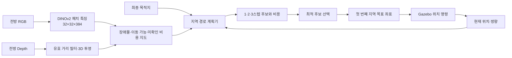

# 교수 피드백 분석과 비전 기반 지역 경로 생성 설계

기준 녹취: `C:\Users\hyuneun\Downloads\새로운 녹음 25.txt`, 2026-09-18, 약 69분. 자동 전사에는 DINO, ViT, Gazebo, ROS 등 기술 용어 오기가 있으므로 문장 그대로보다 질의 흐름을 기준으로 해석했다. 참석자 1은 지도교수, 참석자 4는 서현은으로 본다.

## 1. 교수의 평가 관점

교수는 사용한 제품명과 모델명을 나열하는 것보다 다음 연결을 확인한다.

1. **필요성:** 왜 이 시스템이 필요한가.
2. **센서 입력:** 실제로 어떤 데이터가 측정되는가.
3. **데이터 표현:** 원시 데이터가 어떤 중간 결과로 바뀌는가.
4. **판단:** 중간 결과를 근거로 어떤 결정을 내리는가.
5. **명령:** 결정이 시스템에 어떤 값으로 전달되는가.
6. **평가:** 그 결정이 좋았다는 것을 어떤 지표와 비교군으로 입증하는가.

앞선 학생 발표에서도 교수는 카메라의 출력, 처리 장치의 역할, 학습 위치, 모델 출력, 임계값 변경 이유를 차례로 확인했다. 따라서 이 프로젝트도 `ROS → Gazebo → DINO` 같은 기술 스택 나열보다 각 블록의 입력과 출력이 중요하다.

## 2. 프로젝트에 직접 준 피드백

| 녹취 시점 | 질문 또는 피드백 | 해석 |
|---|---|---|
| 46:06~48:24 | 프로젝트 범위와 Gazebo·카메라·제어의 역할 확인 | 비전 판단, 경로 생성, 비행 제어를 구분해야 한다. 현재는 동역학 제어가 아니라 위치 명령을 준다. |
| 49:17~50:00 | 출발지부터 목적지까지 경로는 어떻게 생성하는가 | 직선 이동과 사전 waypoint만으로는 비전 기반 경로 생성이라고 보기 어렵다. |
| 51:37~52:28 | 회피하려면 어느 지점으로 갈지 정해야 한다 | 장애물 검출 결과를 새로운 지역 목표 좌표로 변환해야 한다. |
| 53:54~59:29 | 몇 도 틀고 얼마나 가며, 다음 시점 목적지는 무엇인가 | 각도 반응만으로는 경로가 아니다. 시간에 따라 이어지는 좌표열과 갱신 규칙이 필요하다. |
| 1:01:08~1:02:51 | DINO 최종 결과가 장애물 유무인지 위치인지 확인 | 특징벡터에서 장애물 영역과 이동 가능 영역까지 만드는 인지 출력 정의가 필요하다. |
| 1:02:51~1:04:02 | 장애물 segmentation 후 다음 목표 지점을 생성 | 객체 종류 인식보다 주행 가능 영역과 장애물 경계가 우선이다. |
| 1:04:02~1:07:39 | 한 스텝, 두 스텝, 여러 스텝을 실시간으로 비교 | 짧은 horizon의 반복 지역 계획을 구현하고 horizon 선택을 실험으로 평가해야 한다. |

교수는 A*를 반드시 요구하지 않았다. 오히려 카메라에 아직 보이지 않는 전체 환경을 미리 안다고 가정하는 전역 A*보다, 현재 관측 범위에서 다음 몇 지점을 만들고 계속 갱신하는 방식을 제안했다.

## 3. 현재 구현과 발표 표현의 정확한 경계

### 구현된 것

- 사전에 생성된 waypoint를 따라가는 순항 상태머신
- 전방 Depth 좌·중·우 거리 비교에 따른 측면 회피
- 하방 DINOv2 특징과 Depth를 결합한 착륙 후보 생성
- 선택된 착륙 좌표로 수평 정렬 후 하강
- RGB, Depth, DINO PCA, 착륙 후보와 선택점 시각화

### 아직 구현되지 않은 것

- 전방 DINO 특징을 이용한 순항 장애물 지도
- 이미지 장애물 영역의 드론 로컬 좌표 투영
- 복수의 지역 waypoint 또는 후보 궤적 생성
- 1·2·3스텝 horizon 비교
- 경로 충돌 검사와 최소 안전거리 비용
- 막힘·센서 끊김·후보 없음 상태의 정지와 복구
- 새 대도시에서의 종단 간 배송 성공률 평가

따라서 현재 결과는 **“DINO 기반 자율 경로 계획 완성”**이 아니라 **“DINO+Depth 착륙 판단과 Depth 기반 반응형 순항 회피 프로토타입”**으로 설명한다.

## 4. 제안하는 시스템 구조



핵심은 **인지와 계획을 분리**하는 것이다.

- 인지 출력: 현재 카메라가 본 범위의 비용 지도
- 계획 출력: 다음에 이동할 world 좌표와 선택된 짧은 경로
- 제어 출력: 해당 좌표로 이동하기 위한 위치 명령

## 5. 인지 모듈

### 5.1 입력

- 전방 RGB 영상
- 같은 시각의 전방 Depth 영상
- 카메라 내부 파라미터
- 드론 위치와 yaw

RGB와 Depth의 시간 차가 기준보다 크면 해당 프레임은 계획에 사용하지 않는다. 센서가 오래되었거나 유효 Depth가 부족하면 정지 상태를 반환한다.

### 5.2 DINO 표현

DINOv2 ViT-S/14는 448×448 RGB를 32×32 패치로 나누고 각 패치에 384차원 특징벡터를 출력한다. DINO가 장애물 좌표나 이동 명령을 직접 출력하지는 않는다.

초기 구현에서는 현재 착륙 탐지와 동일하게 다음 절차를 재사용한다.

1. 패치 특징을 정규화한다.
2. K-means로 시각적으로 비슷한 영역을 묶는다.
3. Depth 경계와 유효 거리 비율을 각 군집에 결합한다.
4. 각 셀을 `free`, `obstacle`, `unknown` 비용으로 변환한다.

DINO의 역할은 물체 이름 분류가 아니라 표면 경계와 시각적 일관성을 제공하는 것이다. 실제 충돌 가능성은 Depth 기하 정보가 우선한다.

### 5.3 로컬 비용 지도

Depth 픽셀 `(u,v,d)`를 카메라 좌표로 변환한다.

```text
X = (u - cx) * d / fx
Y = (v - cy) * d / fy
Z = d
```

그다음 카메라 extrinsic과 드론 yaw를 적용해 드론 중심의 수평 격자에 투영한다. 초기 지도 범위는 실제 카메라 시야와 Depth 최대거리에서 정하고, 임의로 전체 도시를 넣지 않는다.

각 격자 셀은 다음 값을 가진다.

- 점유 비용: 장애물로 관측된 정도
- clearance: 가장 가까운 장애물과의 거리
- 관측 상태: free / obstacle / unknown
- DINO 경계 또는 군집 신뢰도
- 관측 시각: 오래된 셀을 폐기하기 위한 timestamp

드론의 안전 반경만큼 장애물 영역을 팽창해 중심점 경로가 안전 반경을 자동으로 지키도록 한다.

## 6. 1·2·3스텝 지역 경로 생성

### 6.1 후보

초기 후보 진행각은 현재 진행 방향을 기준으로 다음처럼 제한한다.

```text
-45°, -30°, -15°, 0°, +15°, +30°, +45°
```

한 스텝 길이 `s`는 상수가 아니라 속도와 계획 주기로부터 먼저 정의한다.

```text
s = speed × planning_period
```

예를 들어 속도 4m/s, 계획 주기 1초라면 한 스텝은 4m다. 실제 값은 카메라 시야와 정지 가능 거리를 함께 보고 실험으로 정한다.

- horizon 1: 후보 최대 7개
- horizon 2: 후보 최대 49개
- horizon 3: 후보 최대 343개

충돌이 확실한 prefix는 즉시 버리는 방식으로 계산량을 줄인다.

### 6.2 비용 함수

각 후보 경로 `τ`의 비용은 다음처럼 구성한다.

```text
J(τ) = wo·Jobstacle
     + wc·Jclearance
     + wg·Jgoal
     + wt·Jturn
     + wl·Jlength
     + wu·Junknown
```

| 항목 | 의미 | 낮을수록 좋은 상태 |
|---|---|---|
| `Jobstacle` | 팽창된 장애물 영역과 충돌 | 충돌 없음 |
| `Jclearance` | 경로 전체의 최소 장애물 거리 | 안전 여유가 큼 |
| `Jgoal` | 후보 끝점에서 최종 목적지까지 거리 | 목적지에 가까움 |
| `Jturn` | 연속 스텝 사이 방향 변화 | 급회전과 좌우 진동이 적음 |
| `Jlength` | 후보 경로 길이 | 불필요한 우회가 짧음 |
| `Junknown` | 관측하지 못한 셀 통과량 | 확인된 공간을 이용함 |

충돌과 최소 안전거리는 soft score보다 먼저 적용하는 hard constraint로 두는 것이 안전하다. 모든 후보가 충돌하거나 unknown뿐이면 `STOP`을 출력한다.

### 6.3 Receding horizon 실행

선택한 후보가 3스텝이어도 세 좌표를 한꺼번에 맹목적으로 실행하지 않는다.

1. 최적 후보 경로를 선택한다.
2. 첫 번째 목표 좌표만 `mission_controller`에 전달한다.
3. 해당 좌표로 이동하는 동안 새 RGB-D를 받는다.
4. 다음 계획 주기에 비용 지도를 갱신한다.
5. 다시 후보를 만들고 선택한다.

이 구조가 움직이는 장애물과 새로 보이는 건물에 대응하는 핵심이다.

## 7. ROS 구성 제안

초기에는 코드 결합을 피하기 위해 두 노드로 나눈다.

### `local_perception.py`

입력:

- 전방 RGB
- 전방 Depth
- 카메라 정보
- odometry/TF

출력:

- 지역 비용 지도
- 장애물·미확인 시각화 영상
- 센서 유효성 및 처리 시간

### `local_path_planner.py`

입력:

- 지역 비용 지도
- 현재 위치와 진행 방향
- 최종 목적지
- 설정된 horizon

출력:

- 선택된 지역 목표 좌표
- 전체 후보 경로와 후보별 비용
- 선택 경로
- `OK / STOP / NO_SENSOR / NO_PATH` 상태

`mission_controller.py`는 선택된 지역 목표를 따라가는 역할만 맡긴다. 기존 `compute_avoid_offset()`은 기준선 실험용으로 보존하고 새 계획기를 검증한 뒤 선택적으로 교체한다.

## 8. 시각화

교수 피드백을 충족하려면 최종 드론 화면만 보여주면 부족하다. 한 화면에서 다음 인과관계를 볼 수 있어야 한다.

1. 전방 RGB와 Depth
2. DINO PCA 또는 군집 결과
3. 장애물·이동 가능·미확인 비용 지도
4. 생성한 모든 후보 경로
5. 선택된 경로와 첫 실행 waypoint
6. 후보별 비용 구성
7. 실제 지나온 궤적과 최소 clearance

후보는 충돌 탈락은 빨강, 유효 후보는 회색, 선택 경로는 초록으로 표시한다. 이 시각화는 디버깅 자료이자 “비전으로 판단했다”는 시연 근거가 된다.

## 9. 실험 설계

### 9.1 비교군

| 실험군 | 목적 |
|---|---|
| 기존 Depth 좌·중·우 반응형 회피 | 현재 구현 기준선 |
| Depth-only + 지역 경로 계획 | 경로 생성 자체의 효과 |
| DINO+Depth + 지역 경로 계획 | DINO 특징 결합의 추가 효과 |

각 방식에서 horizon 1, 2, 3을 같은 장면과 초기조건으로 비교한다. DINO의 효과와 horizon의 효과를 한꺼번에 섞지 않도록 단계적으로 실험한다.

### 9.2 시험 장면

- 장애물 없음: 직진성과 불필요한 흔들림 확인
- 중앙 단일 장애물: 기본 우회 확인
- 좌우 비대칭 장애물: 넓은 통로 선택 확인
- 연속 두 장애물: 한 스텝과 다중 스텝 차이 확인
- U자 또는 막다른 구조: 지역 계획의 한계와 STOP 확인
- 좁은 건물 협곡: 안전 반경과 진동 확인
- 센서 유효값 부족: 안전 정지 확인
- 이후 단계에서 움직이는 장애물 추가

### 9.3 지표

- 목적지 도달 성공률
- 충돌 또는 장애물 관통 횟수
- 경로 중 최소 장애물 거리
- 실제 경로 길이와 직선거리 대비 비율
- 목적지 도달 시간
- 계획 실패·정지·재계획 횟수
- 좌우 방향 전환 횟수와 heading 변화량
- 프레임당 인지 시간과 계획 시간
- DINO+Depth와 Depth-only의 비용 지도 일치·오류 사례

각 조건은 한 번의 인상적인 영상이 아니라 여러 seed와 시작 위치로 반복한다. 평균뿐 아니라 실패 사례와 분산을 함께 남긴다.

## 10. 데이터에서 결론을 만드는 방식

예를 들어 다음과 같은 결과가 관찰될 수 있다.

- horizon 1에서 좌우 전환 횟수가 많다 → 근시안적 판단으로 진동한다.
- horizon 2에서 최소 clearance와 경로 길이가 함께 개선된다 → 다음 두 지점을 보는 것이 유효하다.
- horizon 3에서 계획 시간은 늘지만 성공률 변화가 없다 → 추가 horizon의 실익이 낮다.
- DINO+Depth가 Depth-only보다 경계 누락을 줄인다 → DINO 결합을 유지한다.
- Gazebo의 깨끗한 Depth에서는 차이가 없다 → DINO의 순항 사용은 제외하거나 노이즈 조건에서 다시 평가한다.

최종 파라미터는 이 관찰을 근거로 선택한다. 결과가 가설과 다르더라도 숨기지 않고 시스템 범위와 한계로 설명한다.

## 11. 구현 단계와 통과 기준

### 단계 0 — 현재 기준선 고정

- 기존 좌·중·우 회피의 입력 거리, 선택 방향, 위치를 로그로 저장한다.
- 단순 장애물 장면에서 성공·충돌·최소거리를 측정한다.

통과 기준: 동일 초기조건으로 반복 실행 가능한 기준선 결과가 있다.

### 단계 1 — Depth-only 비용 지도

- 전방 Depth를 로컬 격자에 투영한다.
- 드론 안전 반경 팽창과 unknown 처리를 구현한다.
- 정지 프레임에서 Gazebo 장애물 위치와 겹치는지 확인한다.

통과 기준: 장애물·빈 공간·미확인 영역이 RViz에서 올바르게 보인다.

### 단계 2 — 1스텝 계획

- 후보 각도, 충돌 제거, 비용 계산, STOP을 구현한다.
- 첫 지역 목표를 `mission_controller`가 따라가게 한다.

통과 기준: 단일 장애물을 피하고 목적지 방향으로 복귀한다.

### 단계 3 — horizon 2·3

- 후보 트리를 확장하고 prefix pruning을 넣는다.
- horizon별 계산 시간과 경로 결과를 기록한다.

통과 기준: 같은 시험 장면에서 1·2·3스텝 비교표와 궤적 그림을 생성한다.

### 단계 4 — DINO 결합

- 전방 RGB DINO 특징을 비용 지도에 결합한다.
- Depth-only와 같은 조건으로 비교한다.

통과 기준: DINO 추가 효과 또는 효과가 없는 조건을 수치와 사례로 설명한다.

### 단계 5 — 대도시 통합

- 짧은 검증 코스부터 통과한 뒤 목적지를 늘린다.
- 막힘, 센서 끊김, 경로 없음에서 반드시 정지한다.

통과 기준: 지정 코스의 반복 성공률과 실패 원인이 기록된다.

## 12. 다음 발표에서 보여줄 최소 결과

다음 발표까지 전체 도시 배송을 완성하는 것보다 다음 네 가지를 확실하게 준비하는 편이 교수 피드백에 직접 답한다.

1. 기존 반응형 회피와 새 경로 생성기의 차이를 보여주는 구조도
2. 장애물 비용 지도와 후보 경로가 동시에 보이는 시각화
3. 1·2·3스텝의 실제 궤적 비교
4. 성공률, 최소 clearance, 경로 길이, 계산 시간 표

발표 문장 예시:

> 기존에는 전방 Depth를 좌·중·우로 나눠 넓은 쪽으로 이동하는 반응형 회피만 구현했습니다. 이번에는 RGB-D에서 지역 장애물 비용 지도를 만들고, 한 개부터 세 개까지의 다음 목표 좌표를 후보로 생성했습니다. 각 후보의 충돌 가능성, 안전거리, 목적지 진척도와 회전량을 평가하고 첫 목표점만 실행한 뒤 매 관측마다 다시 계획합니다. 동일 장면을 반복해 horizon별 안전성과 계산량을 비교하고 최종 설정을 선택했습니다.

